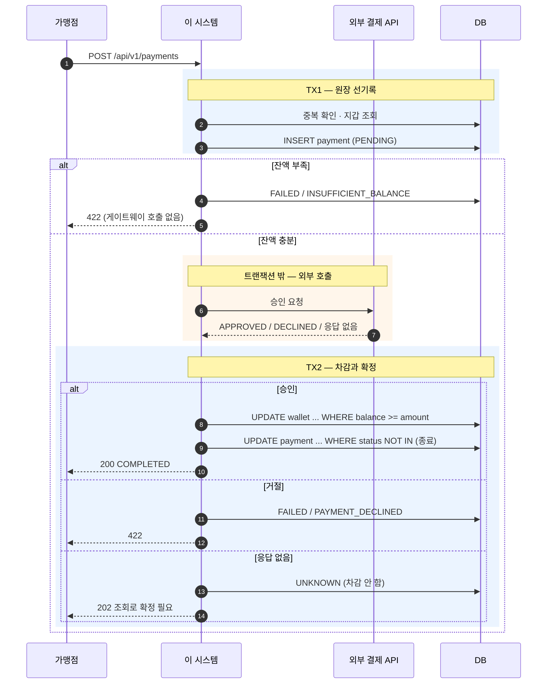
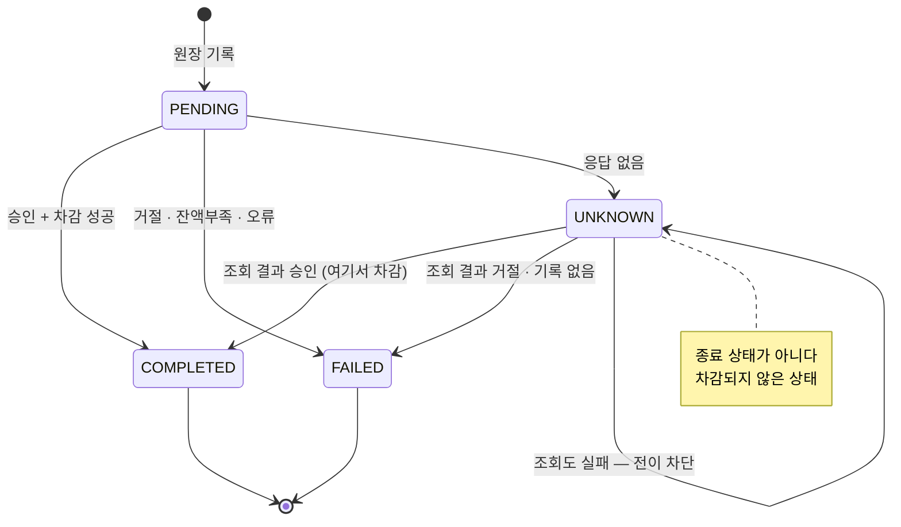
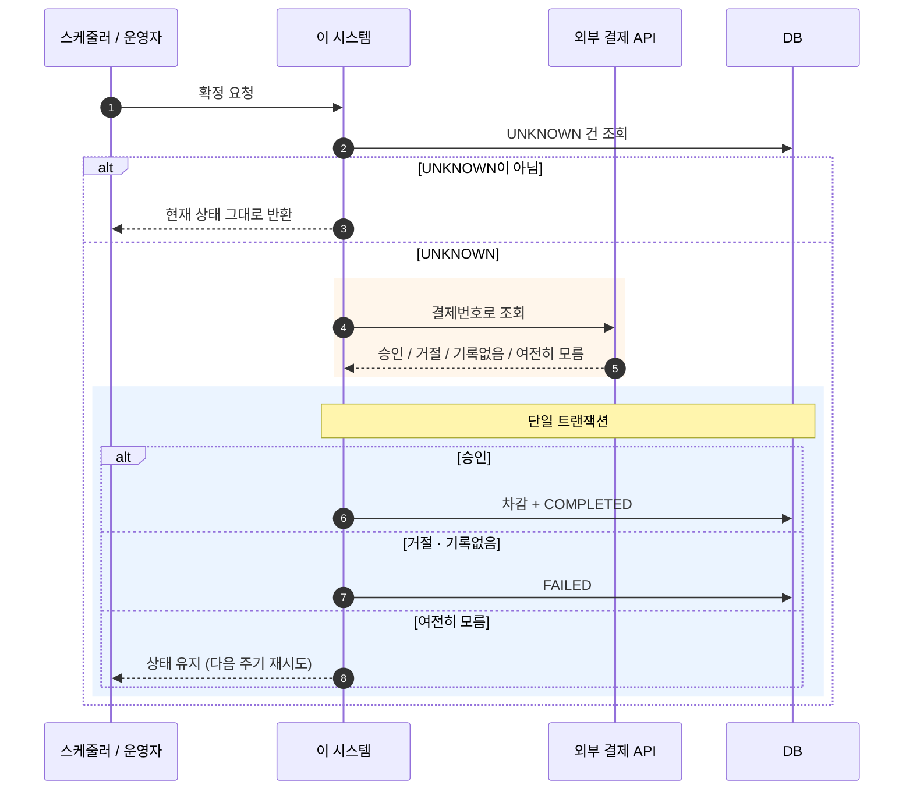

# 스위치원 결제 시스템

3rd party 가맹점에게 결제 API를 제공하고, 외부 결제사 승인 결과에 따라 고객 지갑 잔액과 결제 원장을 정합성 있게 관리하는 백엔드입니다.

**우리가 게이트웨이(PG)입니다.** 가맹점이 우리를 호출하고, 우리가 외부 결제사를 호출합니다.

```
가맹점 ──merchantPaymentNo──> [이 시스템] ──> 외부 결제 API
        (받는 값)                              externalTransactionId
                                                (받는 값)
```

---

## 빠른 시작

```bash
./gradlew bootRun
```

Docker도, 별도 DB 설치도 필요 없습니다. H2 인메모리에 Flyway가 스키마와 시드 데이터를 자동으로 넣습니다.

| 항목 | 주소 |
|---|---|
| **API 문서 (Scalar)** | http://localhost:18080/scalar |
| 헬스 체크 | http://localhost:18080/actuator/health |
| H2 콘솔 | http://localhost:18080/h2-console |

포트가 **18080**입니다. JDBC URL은 `jdbc:h2:mem:switchwon`, 사용자 `sa`, 비밀번호 없음입니다.

첫 요청을 보내봅니다.

```bash
curl -X POST http://localhost:18080/api/v1/payments \
  -H 'Content-Type: application/json' \
  -d '{"merchantPaymentNo":"PAY-001","walletId":1,"amount":100.0000,"currency":"USD"}'
```

`http/` 디렉터리에 시나리오별 요청 예시가 있습니다. IntelliJ HTTP Client로 바로 실행할 수 있습니다.

**요구 환경**: Java 25 (Gradle toolchain이 자동으로 받습니다), Spring Boot 3.5.16, Gradle 9.2.1

---

## 해결하고자 하는 문제

결제는 **두 개의 원장에 걸쳐 있습니다.** 외부 결제사의 원장과 우리 지갑의 원장이죠. 두 원장은 서로 다른 시스템에 있어 **한 트랜잭션으로 묶을 수 없습니다.**

여기서 나오는 상황이 이 시스템이 푸는 문제입니다.

**외부는 승인했는데 우리 차감이 실패하면?** 고객 돈은 빠졌는데 서비스는 못 받습니다. 가장 나쁜 결과라, 승인 전에 잔액을 먼저 확인해 게이트웨이 호출 자체를 막습니다.

**응답이 오지 않으면?** 승인됐는지 아닌지 모릅니다. 이걸 "실패"로 단정하면 위 상황이 그대로 벌어집니다. 그래서 **결과 미상(`UNKNOWN`)**이라는 별도 상태를 두고, 나중에 조회로 확정합니다.

**같은 요청이 두 번 오면?** 네트워크 타임아웃 후 재시도는 정상적인 행동입니다. 막을 수 없으니 서버가 스스로를 지켜야 합니다. 가맹점이 발급한 결제번호를 멱등 키로 삼습니다.

**두 요청이 동시에 오면?** 잔액이 두 번 빠질 수 있습니다. 애플리케이션 코드로는 막을 수 없어 DB 제약에 맡깁니다.

---

## 정책

이 시스템의 성격을 규정하는 세 가지입니다. 전체 처리 규칙은 [SPEC §6](docs/SPEC.md)에 있습니다.

### 타임아웃은 실패가 아닙니다

응답을 받지 못하면 `UNKNOWN`으로 기록하고 **잔액을 차감하지 않습니다.** 나중에 게이트웨이에 되물어 확정합니다. 응답은 **202 Accepted**입니다 — 실패(4xx/5xx)가 아니라 "아직 모른다"는 뜻입니다.

→ [ADR 0004](docs/adr/0004-timeout-is-indoubt.md)

### 잔액 부족은 게이트웨이 호출 전에 거릅니다

명세의 시퀀스는 승인 후 잔액을 확인하지만, 그러면 **승인은 났는데 차감이 실패하는 미아 거래**가 생깁니다. 사전 확인을 추가해 그 경로 자체를 줄였습니다.

사전 확인을 통과한 뒤에도 동시 결제로 잔액이 빠질 수 있습니다. 그때는 미아 거래로 기록하고 메트릭을 올립니다.

→ [ADR 0005](docs/adr/0005-pre-check-balance-before-external-call.md)

### 같은 결제번호 재요청은 재차감하지 않습니다

결제번호를 **가맹점이 발급**합니다. 서버가 채번하면 타임아웃 시 가맹점이 그 번호를 모르므로 재시도도 조회도 할 수 없습니다.

- 이미 끝난 건이면 → 최초 결과를 그대로 반환
- 아직 처리 중이면 → **409 Conflict**

→ [ADR 0002](docs/adr/0002-payment-no-as-idempotency-key.md), [ADR 0011](docs/adr/0011-merchant-payment-no.md)

---

## 비즈니스 로직 흐름

### 결제 처리

- 가맹점이 결제번호·지갑·금액·통화를 보냅니다
- **같은 결제번호가 있는지 확인** — 끝난 건이면 그 결과를 반환하고, 처리 중이면 409
- 지갑을 조회해 **통화가 맞는지** 확인 — 다르면 400
- **결제 원장을 `PENDING`으로 먼저 기록하고 커밋** — 여기서 죽어도 원장이 남아 나중에 추적할 수 있습니다
- **잔액이 충분한지 확인** — 부족하면 게이트웨이를 부르지 않고 422로 끝냅니다
- **외부 결제사에 승인을 요청** — 이 구간은 트랜잭션 밖입니다
- 결과에 따라 **잔액을 차감하고 원장을 확정**합니다



**TX1과 TX2 사이에 원자성이 없습니다.** 의도한 설계입니다 — 외부 호출을 트랜잭션 안에 두면 게이트웨이가 느릴 때 DB 커넥션과 락을 붙잡습니다. 그 틈에 죽으면 `PENDING` 원장이 남고, 정합성 확인이 주워갑니다.

→ [ADR 0001](docs/adr/0001-external-call-outside-transaction.md)

### 결제 상태



`COMPLETED`와 `FAILED`는 종료 상태라 더 이상 전이하지 않습니다. **`UNKNOWN`은 종료가 아닙니다** — 확정을 기다리는 중이고 잔액은 아직 그대로입니다.

### 정합성 확인

- 결과 미상인 결제를 오래된 것부터 가져옵니다
- 이미 `UNKNOWN`이 아니면 건드리지 않습니다
- **게이트웨이에 그 결제번호로 되묻습니다** — 트랜잭션 밖입니다
- 승인이었다면 **이때 비로소 차감하고** `COMPLETED`로 확정합니다
- 조회 자체가 실패하면 상태를 그대로 두고 다음 기회를 기다립니다



기본 프로파일(`dev`)에서는 **스케줄러가 꺼져 있습니다.** 관리자 API로 직접 호출해 확정합니다.

### 지갑 충전

외부 호출이 없어 훨씬 단순합니다.

- 같은 충전번호가 있으면 **최초 이력을 그대로 반환**합니다
- 지갑을 조회해 통화를 확인합니다
- **이력을 먼저 기록하고 잔액을 늘립니다** — 한 트랜잭션입니다

중간 상태가 존재할 수 없어 `UNKNOWN`이 없습니다. 성공하면 행이 있고 실패하면 롤백되어 행이 없습니다.

---

## 실행 방법

### API 목록

| 메서드 | 경로 | 설명 |
|---|---|---|
| POST | `/api/v1/payments` | 결제 요청 |
| GET | `/api/v1/payments/{merchantPaymentNo}` | 결제 단건 조회 |
| GET | `/api/v1/payments` | 결제 목록 조회 (상태·지갑·기간 필터) |
| POST | `/api/v1/admin/payments/{merchantPaymentNo}/reconcile` | 정합성 확인 |
| GET | `/api/v1/wallets/{walletId}` | 지갑 잔액 조회 |
| POST | `/api/v1/wallets/{walletId}/charge` | 지갑 충전 |

응답은 모두 같은 래퍼를 씁니다. 본문 필드명이 **`returnObject`**이고, `code`는 숫자가 아니라 문자열입니다.

```json
{
  "code": "OK",
  "message": "정상적으로 처리되었습니다.",
  "returnObject": { }
}
```

### 시나리오 재현

`merchantPaymentNo` 접두어로 외부 결제사의 동작을 지정합니다. 별도 설정 없이 실패 경로를 눌러볼 수 있습니다.

| 접두어 | 승인 결과 | 상태 | HTTP |
|---|---|---|---|
| (없음) | 승인 | `COMPLETED` | 200 |
| `TIMEOUT-` | 응답 없음 | `UNKNOWN` | **202** |
| `DECLINE-` | 승인 거절 | `FAILED` (재시도 불가) | 422 |
| `ERR500-` | 서버 오류 | `FAILED` (**재시도 가능**) | 500 |
| `ERR400-` | 잘못된 요청 | `FAILED` (재시도 불가) | 500 |
| `SLOW-` | 정상 승인 | `COMPLETED` | 200 |

`SLOW-`는 예약된 접두어이고 **지연 재현은 아직 구현하지 않았습니다.** 현재는 정상 승인과 같습니다.

**조회(`reconcile`) 시에는 매핑이 다릅니다.** 이 차이가 정합성 확인의 핵심입니다.

| 접두어 | 조회 결과 | 확정 후 |
|---|---|---|
| `TIMEOUT-` | 승인 | **`COMPLETED` — 여기서 차감** |
| `DECLINE-` | 거절 | `FAILED` |
| `ERR500-` | 여전히 모름 | `UNKNOWN` 유지 |
| `ERR400-` | 기록 없음 | `FAILED` |

### 미리 준비된 지갑

| walletId | 통화 | 잔액 | 용도 |
|---|---|---|---|
| 1 | USD | 1000.0000 | 정상 결제 |
| 2 | USD | 10.0000 | 잔액 부족 재현 |
| 3 | JPY | 50000.0000 | 통화 불일치 재현 |

인메모리라 재기동하면 초기 상태로 돌아갑니다.

### 결과 미상 확정 데모

이 시스템의 핵심 시나리오입니다.

```bash
# 1. 타임아웃 재현 — 202, 잔액은 그대로
curl -X POST http://localhost:18080/api/v1/payments \
  -H 'Content-Type: application/json' \
  -d '{"merchantPaymentNo":"TIMEOUT-001","walletId":1,"amount":10.0000,"currency":"USD"}'

curl http://localhost:18080/api/v1/wallets/1        # 잔액 변화 없음

# 2. 정합성 확인 — 게이트웨이가 승인으로 답하고, 이때 차감된다
curl -X POST http://localhost:18080/api/v1/admin/payments/TIMEOUT-001/reconcile

curl http://localhost:18080/api/v1/wallets/1        # 10.0000 만큼 줄어 있음
```

1번에서 **202**가 나오고 잔액이 그대로인 것, 2번 이후에야 줄어드는 것이 핵심입니다.

### 테스트

```bash
./gradlew test
```

**222건** 통과합니다 (2026-08-12 기준). 단위 테스트, 통합 테스트, 동시성 테스트, ArchUnit 아키텍처 규칙 20개가 포함됩니다.

```bash
./gradlew test -PshowSql       # SQL 로그와 함께
```

---

## 향후 확장 시 고려사항

### 지금은 단일 인스턴스 전제입니다

`prod` 프로파일도 H2 인메모리를 씁니다. 인메모리 DB는 프로세스에 종속되므로 **여러 대를 띄우면 DB가 인스턴스 수만큼 갈라집니다.** 수평 확장을 하려면 공유 DB로 바꾸는 것이 선결 조건입니다.

### 정합성을 지키는 것은 DB 제약입니다

락은 **0건**입니다. `synchronized`도 `@Lock`도 `@Version`도 쓰지 않습니다.

| 보장 | 수단 |
|---|---|
| 멱등성 | `uk_merchant_payment_no` UNIQUE |
| 원자적 차감 | `UPDATE ... WHERE balance >= :amount` |
| 상태 전이 | `UPDATE ... WHERE status NOT IN (종료)` |

**판정과 쓰기가 SQL 한 문장에 들어가서** 락이 필요 없었습니다. 다만 이건 도메인이 단순해서 가능했고, 네 가지 전제 중 하나라도 깨지면 다시 판단해야 합니다.

| 전제 | 깨지는 경우 |
|---|---|
| 단일 행 | 지갑 간 이체 |
| 고정 금액 | 잔액 비율로 계산하는 수수료 |
| 단방향 상태 머신 | 부분 취소·환불 |
| 불변식이 한 행 안에 | 일일 결제 한도 |

→ [ADR 0012](docs/adr/0012-conditional-update-for-state-transition.md)

### DB를 늘리면 전제가 무너집니다

읽기 복제를 붙이면 복제 지연 때문에 이미 확정된 건을 미확정으로 착각할 수 있습니다. 샤딩하면 UNIQUE 제약이 샤드별이 되어 **멱등 보장 자체가 깨집니다.**

→ [ADR 0006](docs/adr/0006-single-server-no-middleware.md)

### 남은 과제

| 항목 | 성격 |
|---|---|
| 동시성 테스트를 MySQL에서 | H2는 READ COMMITTED, InnoDB는 REPEATABLE READ |
| 스케줄러 다중 실행 방지 | 정합성이 아니라 **효율** 문제. ShedLock 등 |
| 멱등 키 파라미터 검증 | 같은 번호에 다른 금액이 오면 거부 (Stripe·Toss 표준) |
| 차감 원장 테이블 | 결제·충전에는 있는데 차감에만 없는 비대칭 |

상세와 판단 근거는 [SPEC §11](docs/SPEC.md)에 있습니다.

---

## 설계 판단과 문서

이 저장소는 **결정의 근거를 남기는 것**을 중요하게 다뤘습니다.

| 문서 | 답하는 질문 |
|---|---|
| [ADR](docs/adr/README.md) (12건) | 왜 이렇게 결정했는가 |
| [SPEC](docs/SPEC.md) | 무엇을 만드는가 (API·스키마·처리 규칙) |
| [PRD](docs/prd/README.md) (4건) | 각 작업 사이클에서 무엇을 왜 만들었는가 |
| [과제 원문](docs/requirement/README.md) | 과제가 무엇을 요구했는가 |

특히 읽어볼 만한 것을 꼽자면 이렇습니다.

- [ADR 0001](docs/adr/0001-external-call-outside-transaction.md) — 외부 호출을 트랜잭션 밖에 둔 이유. 이 시스템 구조의 출발점입니다
- [ADR 0004](docs/adr/0004-timeout-is-indoubt.md) — 타임아웃을 실패로 다루지 않는 이유
- [ADR 0012](docs/adr/0012-conditional-update-for-state-transition.md) — 동시 확정 시 이중 차감을 재현하고 막은 과정
- [PRD-002](docs/prd/PRD-002-조회와정합성.md) — 완료 판정이 불완전했던 사실과 그 발견 경위

### 기술 스택

Java 25 · Spring Boot 3.5.16 · Spring Data JPA · H2 · Flyway · springdoc + Scalar · ArchUnit · Micrometer
