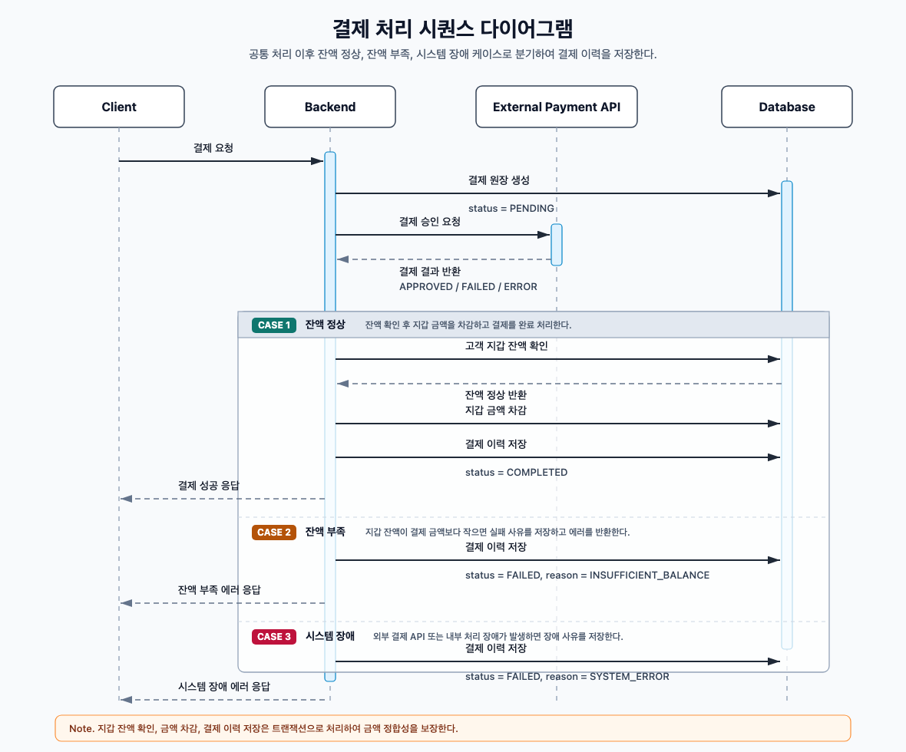

---

# [백엔드 개발자 과제] 결제 시스템 구축
안녕하세요! 저희 채용 과정에 참여해주셔서 진심으로 감사합니다.
본 프로젝트는 가상의 결제 시스템을 만들어 3rd party 외부 결제를 연동하고, 이를 기반으로 고객의 결제 이력, 정합성을 확인하기 위한 서버 시스템을 구축하는 과제입니다. 본 과제를 통해 지원자님의 기술적 역량과 문제 해결 능력을 확인하고자 합니다.

## ✉️ 과제 제출 방법
- 제출 마감: 과제를 전달 받은 <u>**다음날 부터 일주일 내에(+7일) 완료**</u>하여 <u>tech@switchwon.com</u> 으로 제출해야 합니다.
- 제출 형식: 소스 코드를 GitHub 리포지토리에 업로드하고, 해당 GitHub 링크를 이메일로 제출해주세요.

## 📝  1. 과제 개요
가상의 3rd party 에게 결제 API를 제공하고, 결제 상태에 따라 승인, 취소, 거부 등의 결제 이력 정보를 데이터베이스에 관리하며, 이를 고객 또는 운영자가 조회할 수 있는 백엔드 시스템을 구현합니다.

---

## ✅ 2. 기술 제약 사항

### 🛠 Tech Stack
- **Language & Framework**: Java 17+ / Spring Boot 3.x
- **Database**: 지원자에게 별도 DB가 제공되지 않으므로 **In-Memory DB(H2)** 또는 **Local DB(SQLite)** 등을 활용 해주세요.

---

## ✅ 3. 시스템 요구사항

시스템은 다음 비즈니스 요구사항을 구현해야 하며, 관련 데이터는 DB에 저장하고 API를 통해 조회 또는 처리할 수 있어야 합니다.

1.  **결제 이력**
    - 결제 원장, 결제 상태에 대한 항목, 사유 등을 저장 합니다.
    - 가상의 고객에 대해 컴플레인을 고려하여 운영상의 모니터링이 가능한 정보를 제공 하여야 합니다.
2.  **고객 지갑**
    - 실시간으로 결제 금액을 확인하고, 결제 상태에 따라 고객 지갑의 금액을 업데이트 합니다.
    - 결제 상태에 따른 금액의 실시간, 정합성이 보장되어야 합니다.
    - 고객 지갑은 결제 API 연동을 통해 충전/차감이 가능해야 합니다.
3.  **외부 결제 API 연동**
    - 가상의 외부 결제 API를 연동하여, 결제 상태를 확인하고, 결제 이력에 반영 합니다.
    - 외부 결제 API는 가상의 3rd party 사의 API를 연동하는 것으로 가정합니다.

#### 시스템 구현에 대한 전반적인 흐름은 아래의 장표를 참고 하여 구현 하도록 합니다.



#### 해당 예시는 구현에 대한 <u>흐름의 예시</u>이며, 실제 구현 시에는 <u>지원자님의 역량에 따라 자유롭게</u> 구현해 주시면 됩니다.

1. 결제 요청이 들어오면 Backend는 결제 원장을 `PENDING` 상태로 먼저 저장한 뒤, 외부 결제 API를 통해 결제 승인 결과를 확인한다.
2.  승인 이후 고객 지갑 잔액을 확인하여 잔액이 충분하면 금액을 차감하고 결제 이력을 `COMPLETED`로 저장하며, 잔액 부족 시 `INSUFFICIENT_BALANCE` 사유로 실패 처리한다.
3. 외부 API 오류나 내부 시스템 장애가 발생한 경우에는 `SYSTEM_ERROR` 사유로 결제 실패 이력을 저장하여 운영 모니터링과 고객 문의 대응에 활용할 수 있도록 한다.

---

## ⚠️ 주의사항

- 공통응답 에러 처리에 대해서는 지원자님의 역량에 따라 구현 부탁 드리겠습니다. 기본 성공 응답 값은 아래의 예시를 참고 부탁 드립니다.
```json
 {
    "code": "OK",
    "message": "정상적으로 처리되었습니다.",
    "returnObject": {
      ...data
    }
}
```
- 과제 진행 시 명시되지 않은 인증, 권한, 세부 정책 등은 지원자님의 판단에 따라 자유롭게 설계해 주세요.
- 프로젝트 제출 시, 코드 실행이 되지 않아 평가가 불가능한 사례가 종종 발생하고 있습니다. 제출 전 최종 실행 여부를 반드시 확인해 주시기 바랍니다.
---